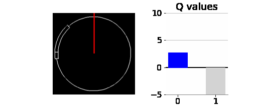
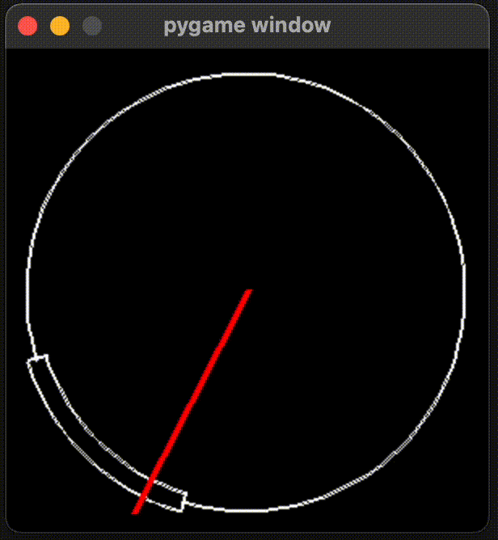
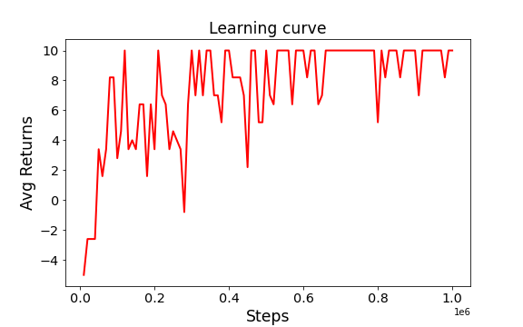
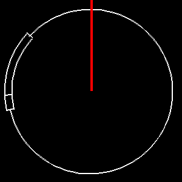

# Skill Check Environment

A toy environment for reinforcement learnings inspired by skill check system in Dead by Daylight and a simple DQN agent solving the environment

  

## Environment

For every episode, a success zone is created in a random position in a circle and a red pointer rotates clockwise on the circle starting from 12 o'clock. The first small proportion of the success zone is regarded as great success zone and the remaining zone as good success zone.
- Success zone: 55 degrees
- Greate success zone: 10 degrees
- Good success zone: 45 degrees

A player should press the space bar once the pointer is inside the success zone. The player get +10 reward if the player succeed the skill check on the great success zone, and +1 reward on the good success zone.
The player get -5 reward if the player presses the space bar before the pointer reaches the success zone, 
or if the player does not perform skill check until the pointer passes the success zone.

The pointer rotates with an angle velocity of 360 degrees per  second, and the environment displays 120 frames per second so that 3 degrees per frame. Action space of the environment consists for two discrete actions, 0 for no operation and 1 for performing skill check.

To play Skill Check environment in human mode, run `env.py`.

~~~
$ python env.py
~~~

Then, the pygame window will appear as below. You can perform a skill check by pressing space bar. 

  

## DQN agent

~~~
python train.py
~~~

I used the same hyperparameters in the original DQN paper, except for the initial epsilon value. Many DQN implementations use an initial epsilon value of 1.0, and linearly decrease to 0.1. However, in the skill check environment, the agent must do nothing to get a reward signal until the pointer reaches the success zone. Of course, the agent learned that doing nothing was better when the pointer was placed outside the success zone from -5.0 reward signal. However, due to a high initial epsilon value, random exploration made a skill check before the pointer reaches the success zone with high probability, so that the agent never observed a reward signal during the training. Thus I used a relatively small initial epsilon value, starting with 0.1 and decreasing to 0.0005.

- The learning curve

  

- Evaluation over 10 episodes

  

